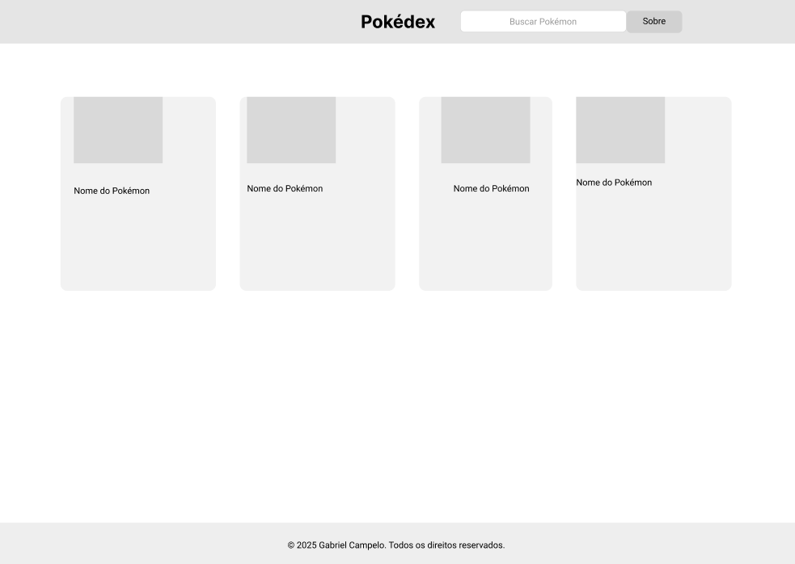

# Pokédex – Wireframe UI

Este projeto apresenta o wireframe de média fidelidade de uma Pokédex, em formato one page, criado no Figma.

## 🎯 Objetivo

O objetivo foi aplicar os conceitos de Arquitetura da Informação e UX Design para criar uma página que exiba cards de Pokémons com informações organizadas e fáceis de navegar.

## 🧱 Estrutura da Página

- **Header:** com logo, campo de busca e botão "Sobre".
- **Grade de Cards:** cards com imagem simulada, nome.
- **Footer:** com informações de direitos.

## 🛠️ Ferramentas

- [Figma](https://figma.com) – para criação do wireframe
- GitHub – para versionamento e documentação

## 📸 Preview

## 🔗 Link para o projeto no Figma

[Figma – Pokédex Wireframe](https://www.figma.com/proto/O1rYjHcUd6NMpXESxios5N/OnePage---Pokedex-Wireframe?page-id=0%3A1&node-id=2-2&p=f&viewport=-252%2C109%2C0.55&t=Ifn0jvx5aCMFeW8D-1&scaling=min-zoom&content-scaling=fixed)

